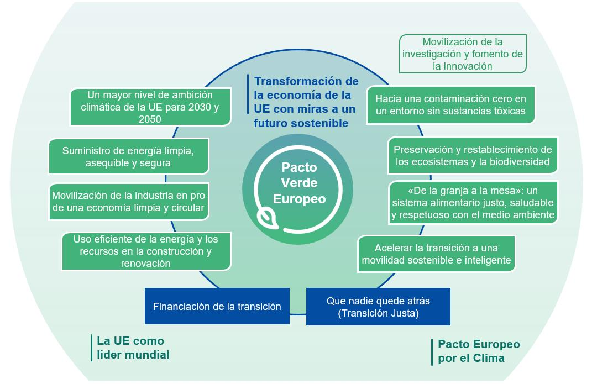

# 1.5. Marco normativo y regulador de la sostenibilidad en Europa
## ¿Qué es el Marco normativo y regulador de la sostenibilidad en Europa y las normas actuales?

Básicamente el marco normativo y regulador de la sostenibilidad en Europa es el conjunto
de reglas y políticas de la Unión Europea que crearon para que las empresas y países sean
más sostenibles y respeten totalmente al medio ambiente. A continuación pondré algunas de
las normas europeas.

* [Pacto verde Europeo:](https://acortar.link/QoIB4o) es un plan que tiene el continente europeo
  para que europa sea neutra en carbono para 2050.

* [Objetivos de reducción de emisiones:](https://acortar.link/CdflmZ) es un plan/norma
  que se ha puesto para cumplir la meta para 2030 de reducir todas las emisiones de gases
  de efecto invernadero, o al menos reducirlos a un 55%.

* [Taxonomía de la UE:](https://acortar.link/Oo9KDv) es un plan que define cuales son
  las actividades económicas que se consideran realmente sostenibles, así se crea la palabra
  "verde" para ayudar al medio ambiente, haciendo que los empresarios saben que podrán meter
  su dinero si quieren ser sostenibles.

* [Regulación de divulgación de información:](https://acortar.link/0cMSDL) es un plan
  que hace que la gente pueda ver si las empresas o instituciones financieras invierten
  y si esas inversiones tienen algún impacto en el medio ambiente, así los clientes o
  consumidores pueden saber si apoyan a los protectos medio ambientales o sostenibles.

* [Ley del clima:](https://acortar.link/LUOVQE) es una norma y a la vez una ley que quiere
  conseguir una neutralidad climática para 2050, haciendo que todos los países de la UE sean
  monitoreados y viendo si cumplen la normativa o reglativa si o si.

* [Estrategia de Economía Circular:](https://acortar.link/JC0AFY) es un plan que tiene la UE
  que quiere reducir el desperdicio máximo y aprovechar los materiales lo más posible, haciendo
  que las empresas ahora están obligadas a diseñar productos que duren mucho más y que sean reparables
  y cuando se rompan, se puedan reciclar.

  

